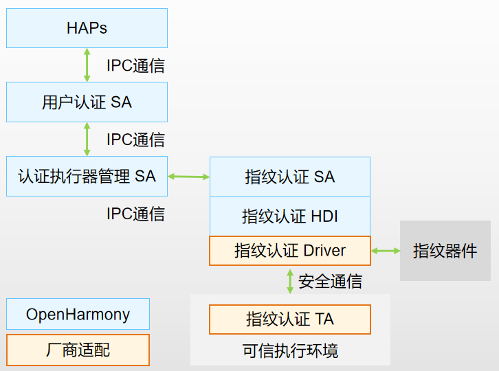

# 指纹认证组件
## 简介

**指纹认证** （fingerprintauth）支持用户指纹的录入，删除和认证功能。

指纹认证是OpenHarmony支持的一种生物认证执行器，按照统一用户认证框架定义的资源注册接口，将指纹认证相关资源信息注册到统一用户认证框架，并根据统一用户认证框架的调度，调用指纹认证HDI，完成指纹的录入，删除，认证和识别等功能。

**图1** 指纹认证架构图



统一认证框架[useriam_user_auth_framework](https://gitee.com/openharmony/useriam_user_auth_framework)通过执行器管理SA进行执行器的管理和调度。指纹认证SA是作为执行器注册到统一用户框架，再由统一用户认证框架在指纹的录入，删除，认证和识别时进行调度。

指纹数据是用户的重要生物识别信息，在指纹认证的处理过程中，我们对用户输入的指纹数据实施了如下安全保护措施：

1. 管理权限：指纹的录入和删除流程定义了较高的访问权限，仅允许系统应用调用。
1. 指纹数据安全存储和比对：指纹认证HDI中定义了南向厂商适配的接口，南向厂商可以自行在可信执行环境内完成指纹数据的安全存储和比对。<sup>注1</sup>

*注1：OpenHarmony开源框架内提供了指纹认证的桩实现，未包含可信执行环境内完成指纹数据的安全存储和比对。*

## 目录

```
//base/useriam/fingerprint_auth
├── bundle.json              # 组件描述文件
├── common                   # 组件公共文件
├── figures                  # README使用的图片
├── sa_profile               # Service Ability 配置文件
└── services                 # Service Ability 服务实现
```

## 使用说明

南向厂商适配指纹认证功能时，需实现IDL文件[`//drivers/interface/fingerprint_auth`](https://gitee.com/openharmony/drivers_interface/tree/master/fingerprint_auth)中定义的接口，[`//drivers/peripheral/fingerprint_auth`](https://gitee.com/openharmony/drivers_peripheral/tree/master/fingerprint_auth)提供了接口的桩实现，桩实现会随hdf(Hardware Driver Foundation)子系统编译，供开发过程参考。指纹数据的提取、比对、存储和录入等过程应在尽可能安全的环境中实现，保证用户指纹数据的的安全保护达到系统内可以提供的最高安全级别（可信执行环境/安全芯片）。

## 相关仓

[useriam_user_auth_framework](https://gitee.com/openharmony/useriam_user_auth_framework)

[useriam_pin_auth](https://gitee.com/openharmony/useriam_pin_auth)

[useriam_face_auth](https://gitee.com/openharmony/useriam_face_auth)

[drivers_interface](https://gitee.com/openharmony/drivers_interface)

[drivers_peripheral](https://gitee.com/openharmony/drivers_peripheral)